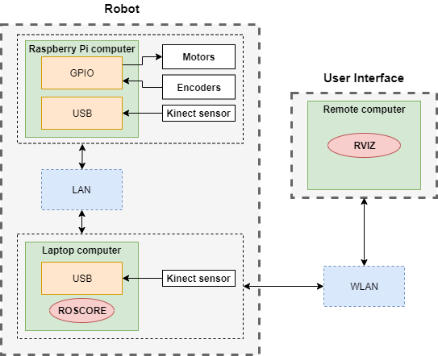
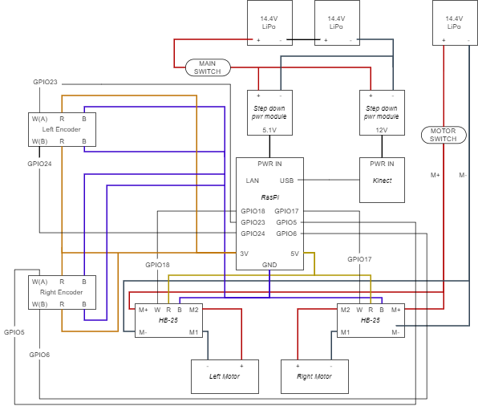

# Indoor mapping and navigation mobile robot based on ROS and Parallax Eddie Platform

In this project, the [Eddie robot](https://www.parallax.com/sites/default/files/downloads/28990-28992-Eddie-Robot-Platform-v1.3.pdf) is re-purposed as a mobile robot platform for carrying 
out a research project on Autonomous Navigation. [Robot Operating System (ROS)](https://www.ros.org/) is a framework 
that will be used to develop the robot system. 

[ROS navigation stack](http://wiki.ros.org/navigation) is used to provide the 
autonomous navigation functionality for our robot. The [requirements to run the navigation stack](http://wiki.ros.org/navigation/Tutorials/RobotSetup) properly 
based on our hardware specifications are fulfilled by implementing our own custom ROS packages as well as 
using existing packages provided by ROS community.

## Hardware setup

There are three computers involved in our setup, two local computers which are equipped on the robot platform 
and a single remote computer. Wired LAN is used for communication between local computers while WLAN is used for 
communication between the local and remote computers as shown below.



**Local computer**

A [Raspberry Pi 3 model B](https://www.raspberrypi.org/products/raspberry-pi-3-model-b/) is equipped on Eddie to interface with the sensors and motors to run odometry 
computations and move Eddie respectively. Due to the low computational power of Raspberry Pi, a separate 
laptop computer is used to run the more computationally demanding functionalities such as SLAM, navigation, 
face detection and high level behaviors.

**Remote computer**

Any remote computer can be used as user interface to send commands to Eddie's onboard computer and also
to run [visualization software](http://wiki.ros.org/rviz) provided by ROS.

## Circuit diagram



## Getting Started

Firstly, we need to install ROS in all the three computers. ROS community has already provide a 
detailed installation guide. It is highly recommended to use Ubuntu as it is the main development platform 
for ROS.

*  [Installing ROS Kinetic on the Raspberry Pi](http://wiki.ros.org/ROSberryPi/Installing%20ROS%20Kinetic%20on%20the%20Raspberry%20Pi)
*  [Installing ROS Melodic on computer](http://wiki.ros.org/melodic/Installation/Ubuntu)

There are two main folders in the repository named `Pi and Laptop` which contains custom ROS packages. 
As the name suggests, the folder contents should go to their respective `~/catkin_ws/src/custom_packages` 
of the computers.

> Please note that in the current system, the `custom_packages` folder are simply for convenience to store your own 
> custom implementations while the `imported_packages` folder is to store packages cloned from ROS community. You may 
omit these folder naming conventions if you wish.


## Libraries used in writing programs

Python is the programming language used for all implementations. The list of libraries used can be installed using
`pip install` command.

**Pi computer**

*  [RPi.GPIO](https://pypi.org/project/RPi.GPIO/)
*  [pigpio](https://pypi.org/project/pigpio/)

**Laptop computer**

*  [OpenCV](https://pypi.org/project/opencv-python/)

## Imported ROS packages in the system

In addition to our own packages, external packages from ROS are also used. Simply clone the respective packages 
into `~/catkin_ws/src/imported_packages` and compile.

**Pi computer**

*  [openni_camera](http://wiki.ros.org/openni_camera)
*  [depthimage_to_laserscan](http://wiki.ros.org/depthimage_to_laserscan)

**Laptop computer**

*  [openni_camera](http://wiki.ros.org/openni_camera)
*  [depthimage_to_laserscan](http://wiki.ros.org/depthimage_to_laserscan)
*  [gmapping](http://wiki.ros.org/gmapping)
*  [navigation](http://wiki.ros.org/navigation)
*  [explorer_lite](http://wiki.ros.org/explore_lite)

You may notice that after cloning all the packages, running `catkin_make` produced errors and failed to compile the 
workspace. In addition, even if it has successfully compiled -- running the node may yield some error resulting 
in the package not running at all when executed. This is due to missing dependencies required by the package.

## Satisfying ROS package dependencies

Installing these dependencies is the same as cloning packages from a repository and compiling the workspace.

**Pi computer**

`robot_odometry`
*  [geometry_msgs](http://wiki.ros.org/geometry_msgs)

`openni_camera`
*  [image_common](http://wiki.ros.org/image_common)
*  [nodelet](http://wiki.ros.org/nodelet)

`depthimage_to_laserscan`
*  [image_common](http://wiki.ros.org/image_common)
*  [image_geometry](http://wiki.ros.org/image_geometry)

**Laptop computer**

`robot_transforms`
*  [geometry_msgs](http://wiki.ros.org/geometry_msgs)
*  [tf2](http://wiki.ros.org/tf2)

`openni_camera`
*  [image_common](http://wiki.ros.org/image_common)
*  [nodelet](http://wiki.ros.org/nodelet)
*  [rgbd_launch](https://wiki.ros.org/rgbd_launch)

`depthimage_to_laserscan`
*  [image_common](http://wiki.ros.org/image_common)
*  [image_geometry](http://wiki.ros.org/image_geometry)

`navigation`
*  None, the package itself contains required dependencies

`gmapping`
*  [openslam_gmapping](http://wiki.ros.org/openslam_gmapping)

`explore_lite`
*  [navigation](http://wiki.ros.org/navigation)

At this point, running `catkin_make` and running individual packages should be successful.

>  for `gmapping`, please refer to "Quigley's programming with ROS Robots" book on the parameter 
tuning. The default tuning is not suitable for use with Kinect sensor.

## Setting up the individual computers to run the system

Before running the packages, we need to check if the computers are able to communicate with each other with 
the current hardware setup. Thankfully, ROS community has provided a useful wiki on how to test this.

*  [Running ROS across multiple machines](http://wiki.ros.org/ROS/Tutorials/MultipleMachines)

**Step 1: Network setup between local computers (Raspberry Pi and Laptop)**

The WLAN from the robot's local computer will be shared to Raspberry Pi through an ethernet cable as 
shown in the diagram earlier in `Hardware Setup`. Run the following on your terminal and follow the guide.

```
nm-connection-editor
```

*  [Sharing wireless internet connection through ethernet](https://askubuntu.com/questions/359856/share-wireless-internet-connection-through-ethernet)

If everything runs smoothly, you should be able to ping between the two local computers. At this point, the entire robot system is ready to be run. 
However, the remote computer would not be able to subscribe to topics published from the Rapsberry Pi. We will address this issue in step 2.

**Step 2: Network setup between robot computers (Raspberry Pi and Laptop) and remote computer**

The master needs to be able to communicate and reach to all computers involved in order to successfully send and receive topics. So we are going to use 
the laptop computer as a WIFI hotspot for the remote computer to connect to. Since it is not possible to both connect to the existing WIFI and broadcast 
a WIFI hotspot using the laptop internal WIFI module, we will be using an external WIFI USB adapter to connect to the existing WIFI 
and use the internal WIFI module to broadcast a WIFI hotspot for the remote computer to connect to.

[Sharing wireless internet connection through wireless hotspot](https://askubuntu.com/questions/318973/how-do-i-create-a-wifi-hotspot-sharing-wireless-internet-connection-single-adap)

Once completely setup, connect to the newly created hotspot with a remote computer.

**Step 3: Setting up the ROS network**

Example of `~/.bashrc` file with our current setup:

**Robot computer 1** (Raspberry Pi) 

eth0 IP: 10.42.0.179
```
[...]
export ROS_IP=10.42.0.179
export ROS_MASTER_URI=http://192.168.31.123:11311
```

**Robot computer 2** (Laptop) **(roscore)**

wlan0 IP: 192.168.31.123
```
[...]
export ROS_IP=192.168.31.123
export ROS_MASTER_URI=http://192.168.31.123:11311
```

**Robot computer 3** (Remote Laptop) 

wlan0 IP: 10.42.1.254
```
[...]
export ROS_IP=10.42.1.254
export ROS_MASTER_URI=http://192.168.31.123:11311
```

After editing the `~/.bashrc` file of each computer, run `source ~/.bashrc` on each computer.

## Running the robot operation

All of the robot functionalities are stored in the two local computers of the robot. As shown 
in the diagram of `hardware setup` previously, the two computers are responsible for running a 
different set of robot functions.

### Running ROS nodes in Raspberry Pi computer

This computer is mainly responsible for motor control and encoder reading layer, odometry computations and 
also kinect sensor operations. Here are the steps to running each functionalities.

*  **Kinect sensor**

`openni_launch` transforms raw data from the device driver into point clouds, disparity images, and other 
products suitable for processing and visualization. We are only interested in the RGB and Depth image here.

```
roslaunch openni_launch openni.launch
```

`depthimage_to_laserscan` emulates a real laser scan by using information from `openni_launch`'s depth image. 
[Navigation stack](http://wiki.ros.org/navigation) requires that a sensor can provide laser scans information to avoid obstacles.


The package does not provide any launch file so we have to create our own named `laserscan.launch` contained within `launch` folder.

```xml
<launch>
    <node pkg="depthimage_to_laserscan" name="depthimage_to_laserscan" type="depthimage_to_laserscan">
        <remap from="image" to="camera/depth/image_raw" />
        <!--<remap from="scan" to="depth_scan" /> -->
        <param name="output_frame_id" value="camera_depth_frame" />
        <param name="range_min" value="0.45" />
    </node>
<launch>
```

```
roslaunch depthimage_to_laserscan laserscan.launch
```

*  **Odometry and encoder reading layer**

`robot_odometry` does odometry computations based on encoder ticks of the robot to achieve localization. [Navigation 
stack](http://wiki.ros.org/navigation) requires that an odometry source (encoders) can provide reliable localization.

```
rosrun robot_odometry odometry.py
```

*  **Teleoperation and Motor control layer**

`robot_controller` is mainly responsible for accepting velocity commands from the navigation stack so it converts
velocity into motor commands. [Navigation stack](http://wiki.ros.org/navigation) requires that a robot base can accept velocity information from the 
stack to move to the robot.

This package is divided into three parts: 

1.  Robot controller (accepts velocity commands to move the robot)

```
rosrun robot_controller controller.py
```

2.  Keyboard driver (captures key strokes e.g W, A, S, D)

```
rosrun robot_controller key_publisher.py
```

3.  Keyboard keys to velocity converter (maps key strokes to a velocity value in cm/s)

```
rosrun robot_controller keys_to_twist.py
```

>  Please note that only #1 is required to be run for the `Navigation stack` to work. #2 and #3 are only to for manual 
control of the robot for testing and debugging purposes. Running all three while navigation stack is running will cause 
the navigation to not work properly.

### Running ROS nodes in laptop computer

This computer is mainly responsible for the heavier workload such as SLAM, navigation, face detection and robot behaviors.

*  **Transforms (tf)**

`robot_transforms` maintains the 3D positional and rotational relationship between different robot frames. In this project, we 
have 3 frames that we need to worry about which are the `camera_link`, `base_link` and `odom`. The tf frames between `camera_link` 
and `base_link` is maintained here while `base_link` to `odom` is maintained by `robot_odometry` node.

```
rosrun robot_transforms transforms.py
```

*  **gmapping**

`gmapping` builds an occupancy grid map based on kinect and encoder sensor informations. [rViz](https://wiki.ros.org/rviz) can be used to 
visualize how the map looks like as the robot navigates around its environment.

```
rosrun gmapping slam_gmapping
```

*  **Navigation stack**

`robot_navigation` takes in information from odometry, sensors, and a goal pose and outputs safe velocity commands that are sent to a 
mobile base. Please read this [wiki](http://wiki.ros.org/navigation) for a more in depth understanding.

```
roslaunch robot_navigation move_base.launch
```

*  **Face detector**

`robot_face_detector` applies Haar's cascades to RGB image of Kinect to detect faces and also compute the 3D position of the detected 
face which will be used as a goal position for the robot to move towards to later in `robot_behavior`.

```
rosrun robot_face_detector face_detector.py
```

*  **Behavior**

`robot_behaviors` is responsible for the high level behavior of the robot which is a simple photo taking behavior. It 
uses [actionlib](https://wiki.ros.org/actionlib) to send a goal position to the navigation stack instead of using rViz interface. 
The goal position here being the center detected face.

```
rosrun robot_behaviors robot_behaviors.py
```

*  **Explorer_lite**

`explorer_lite` allows the robot to explore frontiers and unexplored regions.

```
roslaunch explorer_lite explore.launch
```

## Visualization of ROS topics

Based on our hardware setup, a remote computer is used to run the [rViz](https://wiki.ros.org/rviz) visualization software. 
There are useful tutorials on how to use rViz in the wiki page. For convenience, an rViz config file has been uploaded for use.

## Built With

* [Robot Operating System](https://www.ros.org/) - The robot framework and development environment
* [RPi GPIO](https://sourceforge.net/p/raspberry-gpio-python/wiki/Home/) - The library used for controlling GPIO ports of Raspberry Pi
* [pigpio](https://pypi.org/project/pigpio/) - The library used for PWM of motors
* [OpenCV](https://opencv.org/) - The library used in face detection implementation
* [PlaySound](https://github.com/TaylorSMarks/playsound) - The library used in behavior implementation

## Authors

* **Hafiq Anas** - *Initial work* - UBD Final Year Project 2018 - 2019


## Acknowledgments

* Thank you AI Lab for lending the Eddie robot platform and lab facilities.

